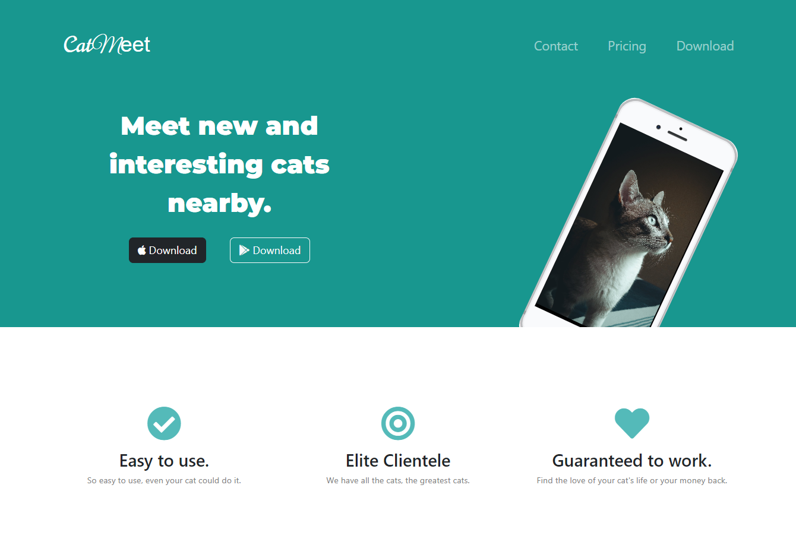
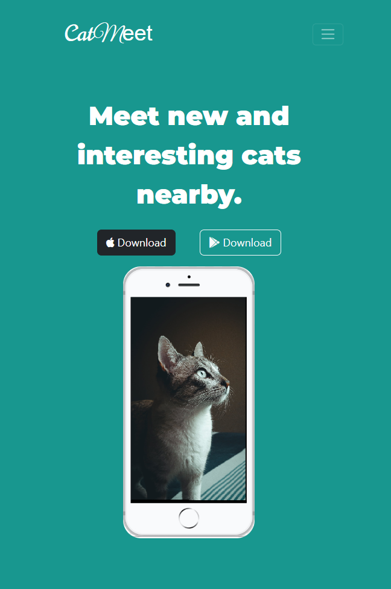

# London App Brewery Complete Web Developer Course Challenge

## Table of contents

- [Overview](#overview)
  - [The challenge](#the-challenge)
  - [Screenshot](#screenshot)
  - [Links](#links)
- [My process](#my-process)
  - [Built with](#built-with)
- [Author](#author)

## Overview

### The challenge

Create a start up landing page that has a title section, features section, a carousel to browse testimonials, a pricing plan section, a call to action where users can download the app, and lastly, a footer containing socials.

### Screenshot

Below is a screenshot of the desktop version of this project.

Below is a screenshot of the mobile version of this project.

### Links

- [Solution URL](https://github.com/Sidi-Ali/catmeet)
- [Live Site URL](https://sidi-ali.github.io/catmeet/)

## My process

I used a mobile-first workflow to complete this project.

### Built with

- HTML
- CSS
- Bootstrap

## Author

- linkedin - [M. A. Sidi-Ali](https://www.linkedin.com/in/muhammad-adamu-sidi-ali-907a486b/)
